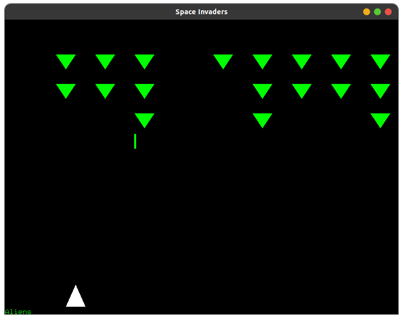

# SpaceInvaders_OpenGL
Space Invaders game made with OpenGL

This game was an university assigment made using C, the objective was to recreate an Atari game using OpenGL.

To run this project navigate to the folder containing the files, then run:

```sh
./main
```

Or you can compile and run this project with:

```sh
g++ main.c -lGL -lglut -lGLU -o main
./main
```


  
